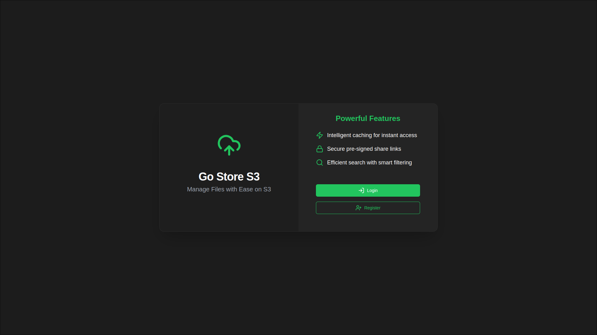
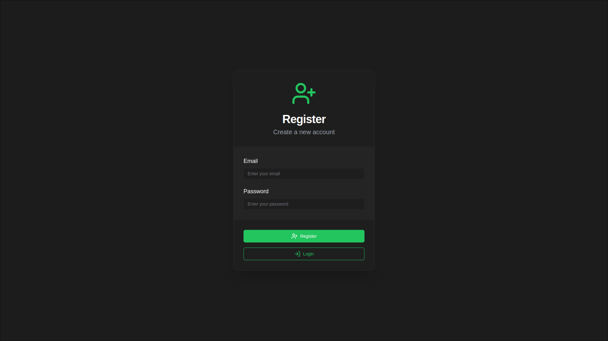
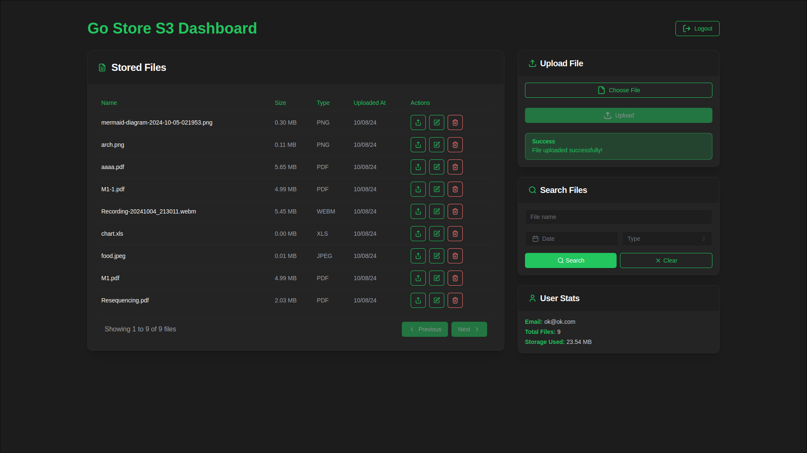

# Go Store S3

Go Store S3 is a user-friendly web application for managing and storing files in the cloud using Amazon S3. It allows you to upload, share, and manage your files with ease, all within a secure and responsive interface.

## Features

-   **Upload files** to Amazon S3.
-   **Delete files** and update file metadata.
-   **Background job** for scheduled file deletion.
-   Share files using **pre-signed URLs** for secure access.
-   Search files with various filters.
- Caching Layer for File Metadata


## Tech Stack

### Client

-   **[Next.js](https://nextjs.org/)**: Fast, scalable React framework for modern web development.
-   **[React](https://react.dev/)**: A library for building user interfaces with components.
-   **[Tailwind CSS](https://tailwindcss.com/)**: Utility-first CSS framework for fast UI development.
-   **[shadcn/ui](https://ui.shadcn.com/)**: Pre-built components for quick and consistent UI building.

### Server

-   **[Go](https://go.dev/)**: High-performance language used for backend services.
-   **[Gin](https://gin-gonic.com/)**: Lightweight web framework for building fast, scalable APIs.
-   **[PostgreSQL](https://www.postgresql.org/)**: Reliable, high-performance relational database.
-   **[Redis](https://redis.io/)**: In-memory data structure store, used for caching to improve performance.

### Infrastructure

-   **[Docker](https://www.docker.com/)**: Containerized environment for simplified development and deployment.

## Getting Started

### Prerequisites

Before you start, make sure you have the following installed:

-   [Docker](https://www.docker.com/) & [Docker Compose](https://docs.docker.com/compose/)
-   [Node.js](https://nodejs.org/en)
-   [Go](https://go.dev/)

### Installation Steps

1.  **Clone the repository**:
    
    ```bash
    git clone https://github.com/ayushh2k/go-store-s3.git 
    cd go-store-s3
    ```
2. **Configure environment variables**:

-   Create a `.env` file in the root directory using the provided `.env.example` file as a template.
-   Update the environment variables as follows:
	```bash
	# Database credentials
	DB_USER=user_name
	DB_PASSWORD=password
	DB_NAME=database_name

	# JWT secret
	JWT_SECRET=your_jwt_secret

	# S3/MinIO credentials
	S3_ENDPOINT=your_s3_endpoint_without_protocol
	S3_ACCESS_KEY=your_s3_access_key
	S3_SECRET_KEY=your_s3_secret_key
	S3_BUCKET_NAME=your_s3_bucket_name

	# Redis credentials
	REDIS_HOST=redis_host
	REDIS_PASSWORD=password
	REDIS_PORT=6379
	REDIS_DB=0
	
	API_URL=http://localhost:8080
	```
3. **Start the development environment**:
	```bash
	docker-compose up --build
	```

4.  **Access the application**:
    
    -   Client: [http://localhost:3000](http://localhost:3000)
    -   Backend APIs: [http://localhost:8080](http://localhost:8080)

## To-Do:

- [ ] Display upload progress using websockets
- [ ] Chunk encryption for multipart uploads
- [ ] Server side pagination
- [ ] Light Mode UI
- [X] Caching file metadata
- [X] Rate Limiting
	
## Screenshots:





## Contributing
Contributions are welcome! Please feel free to submit a Pull Request.
